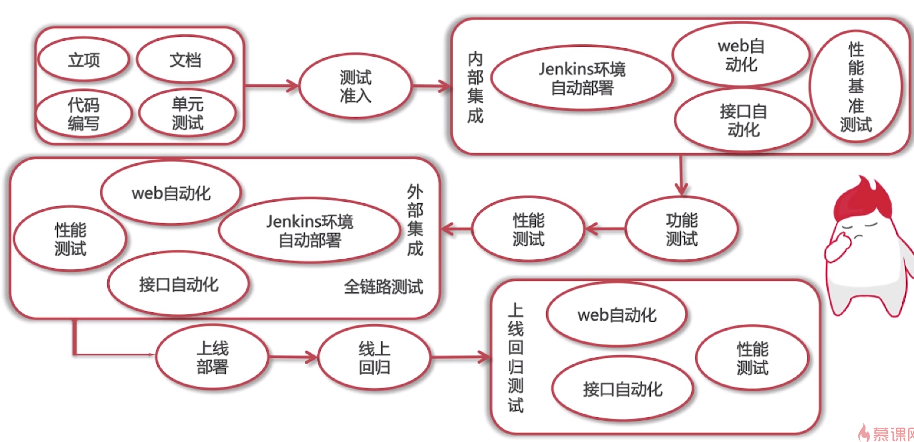
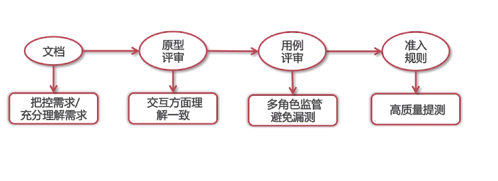

# 二面面试的核心考察点

1、你是如何保证项目质量的

提前了解需求、代码编写

2、你是如何推进项目进度的

3、推进项目的过程中遇到了哪些问题

内部问题：

+ 无自动化、测试效率低，推进自动化的测试能力
+ 有自动化用例维护不及时：用例维护在本地，推进用例以原始数据的形式存储在数据库中

外部问题：

+ 无文档
  + 与开发人员属于同一团队的情况
  + 与开发人员不属于同一团队的情况
+ 有文档，但文档更新不及时
  + 提高自己对文档的重视

4、为项目做了哪些贡献

突出价值：

+ 工作成果数字化
  + 提升50%的测 的测试效率
  + 提高30%的测试覆盖率
+ 价值高度化
  + 推进项目流程的标准化
    + 文档建设
    + 持续集成
    + 测试准入