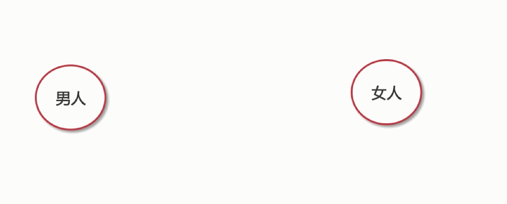

# 综合素质考察点

1、性格

2、稳定性

3、沟通能力

4、团队协作能力

5、管理能力（个人及团队）

6、目标感与责任感

#### 真题 

1、业务能力（特定行业的业务知识）

2、团队中有人不服你怎么办？（管理岗必备）

要产生工作之外的联系

3、未来的职业规划是什么

无休止的技术之路 

​	尽自己最大的努力为的团队、为公司的效能贡献力量

4、你认为你能够胜任这个工作的原因是什么

个人优势：

+ 持续的学习能力---丰富知识体系可为公司做更大的贡献
+ 乐观的态度--遇到困难优先去想解决办法，而不是逃避
+ 对工作的热情---在工作中能够找到自信与成就感

5、为什么要离职

不可触碰的雷区：

+ 吐槽加班
+ 吐槽公司和老板
+ 吐槽团队
+ 吐槽制度

6、团队中有工作需要加班，你会如何处理

+ 首先表明态度
+ 思考解决办法
+ 提高工作效率

7、经典个人问题

+ 你自己有什么缺点
  + 只讲技术方面，比如只是的深度还不够，源码阅读的比较少
  + 切记不要讲性格方面的缺点
+ 结婚与生子
  + 核心：短时间内没有计划
+ 业余时间有什么爱好
  + 一定要是积极向上的爱好
  + 对新技术的探索：看看论坛、技术文章之类的
  + 同事聚会，加强默契与了解

#### 三面核心关键词

1、乐观

2、好学

3、积极

4、有责任

5、随和

6、奉献